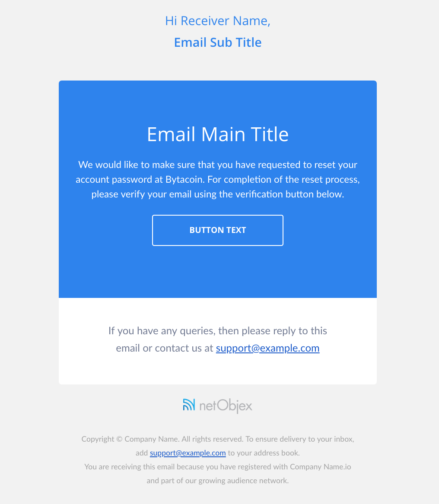

## NetObjex Mailing Service
Provides option for configurable HTML Template and send the email over SendGrid mail service.

### Setup Environment Variables
Do not hardcode your Twilio SendGrid API Key into your code. Instead, use an environment variable or some other secure means of protecting your Twilio SendGrid API Key. Following is an example of using an environment variable.

echo "export SENDGRID_API_KEY='YOUR_API_KEY'" > sendgrid.env
echo "sendgrid.env" >> .gitignore
source ./sendgrid.env

### Install Package
npm install --save nox-emailer

### Quick Start, Hello Email
##### Email Template Configuration
```javascript
let configuration = {
  styles: {
    backgroundColor: "#F2F2F2", // Email background color.
    primaryBackgroundColor: "#2780F0", // Primary box color.
    secondaryBackgroundColor: "FFFFFF", // Secondary box background color.
    primaryTextColor: "#2780F0", // Primary Text Color for Primary box background color.
    lightTextColor: "#FFFFFF", // Light text color.
    darkTextColor: "#717993", // Dark Text color for Secondary box background color.
    footerTextColor: "#a2a2a2" // Footer Text Color
  },
  general: {
    templateName: "NetObjex Email Template",
    supportEmail: "support@example.com",
    companyName: "Company Name",
    companyLogo: "https://www.netobjex.com/wp-content/themes/netobjex-4/images/nO_Logo.png",
    companyIcon: "https://www.netobjex.com/wp-content/uploads/2019/07/nO_white.png"
  }
}
```

#### Email Content Configurations
```javascript
let data = {
  subject: "Subject of Email",
  receiverName : "Receiver Name",
  receiverEmail: "tittu@netobjex.com",
  subTitle : "Email Sub Title",
  mainTitle : "Email Main Title",
  mailContent : `Lorem Ipsum is simply dummy text of the printing and typesetting industry. Lorem Ipsum
  has been the industry's standard dummy text ever since the 1500s, when an unknown printer took.`,
  buttonLink : "http://url.com/path/to/token",
  buttonText : "BUTTON TEXT"
}
```
#### Email Configuration
```javascript
let emailConfiguration = {
  toAddress: "tittu@netobjex.com",
  fromAddress: "noreply@netobjex.com",
  subject: "Welcome Email"
}
```
#### Code Sample
```javascript
template.generateEmailContent(configuration, data)
.then(htmlTemplate => {
  mailer.sendEmail(emailConfiguration, htmlTemplate)
  .then(response => {
    console.log(response);
  }).catch(error => {
    console.log(error);
  });

}).catch(error => {
  console.log(error);
});
```

### Preview

